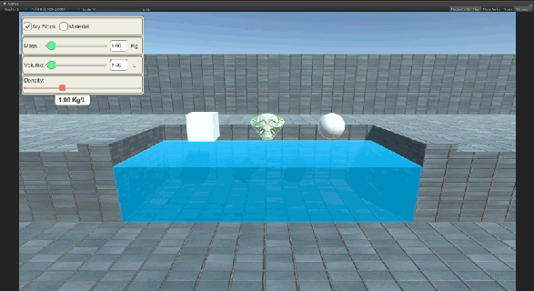
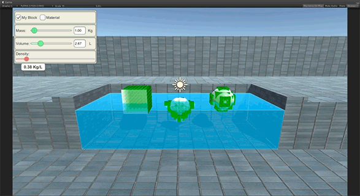
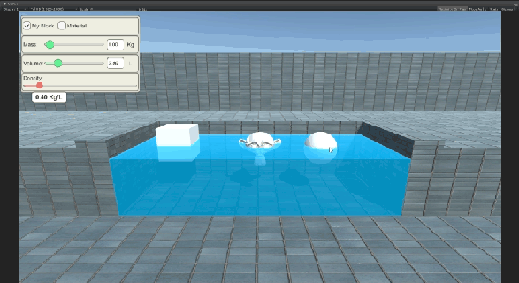

# UnityExperiment-Density

Recreation a Phet Interactive Simulationin Unity!

**Original Experiment:** [https://phet.colorado.edu/en/simulation/legacy/density]()

## Screenshot
Playing with mass and volume:




Visualizing voxels:




Mouse Interation:




## About Development

This programming exercise was required as a job adimission process, which consist
recreate one simulation of Phet Colorado using Unity or Unreal. I decided use Unity,
because it's more comfortable to me program in C# with Unity Framework.

Some of my difficulties in this project:
 Despite the bouyancy formula is easy to read:

```
    Bforce = d * Vd * g;

    /* Where:
    * Bforce = is the bouyancy force;
    * d = dencity of liquid;
    * Vd = is the displaced Volume;
    * g = gravity acceleration;
    */
```

 Measure how much volume was displaced is not a trivial task. To solve this, two
 solutions came to my mind:

1. **Just static cubes are allowed:** In this case just take the Y position of cube and water level, and subtract them.
2. **Any kind 3D model are allowed:** Make the 3D model as voxels, and count how much of them is inside of water. After that, multiply by voxel's volume and voila.

 Without a thinking twice, I chose the second approach. The problems with this method are:
- Fixed size of voxel, like I did, is a huge problem. Very tiny object will be
 considered as just one voxel. And the big 3D element will produce tons of voxel.
Take a look:

```
    VoxelSize: 25cm (0.25f, 0.25f, 0.25f);
    Tiny Object: 40 cm (0.4f, 0.4f, 0.4f) -> 1 voxel only;
    Large Object: 10m (10f, 10f, 10f) -> 64k of voxels!
    
I should rewrite the code voxel's quantity be static, do not matter how large object is;
```

- Large amount of voxel increase the processor overhead by power of 3!
- Another issue: Once this approximation of the real value, the object never
will get harmony. Because when you push the object upwards, some voxels
change status to not submerged, and they will gravity push object downwars. After that,
the same voxels get submerged status again, making bouyancy push object to up.

## About
### Topics
- Density
- Mass
- Volume

### Description
Why do objects like wood float in water? Does it depend on size? Create a custom
object to explore the effects of mass and volume on density. Can you discover 
the relationship? Use the scale to measure the mass of an object, then hold the 
object under water to measure its volume. Can you identify all the mystery
objects?

### Sample Learning Goals
Describe how the concept of density relates to an object's mass and volume.
Explain how objects of similar mass can have differing volume, and how objects
of similar volume can have differing mass. Explain why changing an object's mass
or volume does not affect its density (ie, understand density as an intensive
property).
Measure the volume of an object by observing the amount of fluid it displaces.
Identify an unknown material by calculating its density and comparing to a table
of known densities.